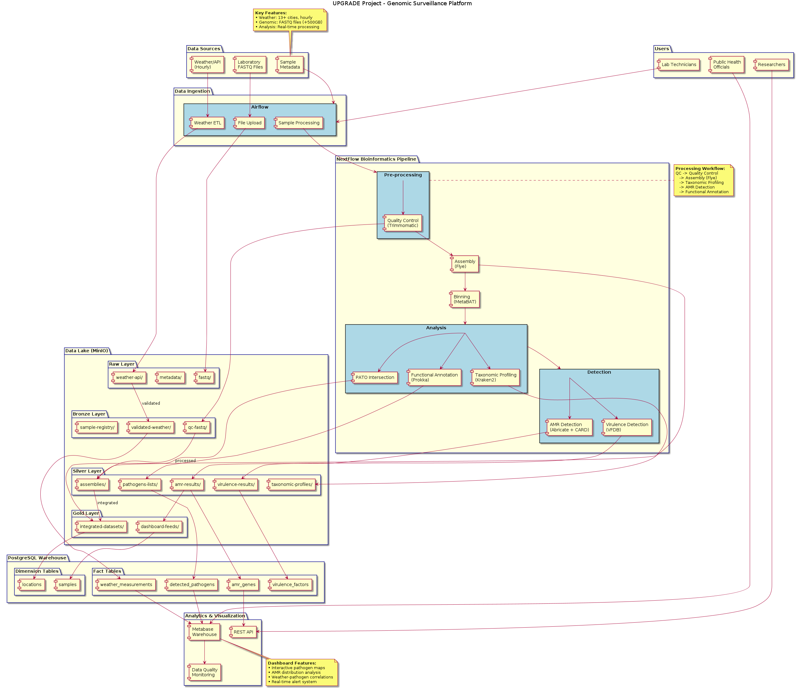

# UPGRADE - Urban Pathogen Genomic Surveillance Network

**Version:** 0.8.5 (Alpha)  
**Last Updated:** December 21, 2025  
**Grant Compliance:** 85% (UPGRADE Aims 1-3)  
**Production Ready:** ❌ No (see Security Considerations)

[]()
[]()
[]()

## Project Overview

The UPGRADE project establishes a dynamic Romanian-Moldovan research collaboration focused on rapid pathogen identification and real-time genomic surveillance in complex urban environments. This project integrates expertise across data generation and bioinformatics analysis to monitor antimicrobial resistance (AMR) genes and pathogens from diverse environmental sources.

## Grant Information

- **Project Title:** Metagenomics and Bioinformatics tools for environmental genomic surveillance of pathogens and antimicrobial resistance genes in public spaces
- **Duration:** 24 months
- **Coordinator:** "Ștefan cel Mare" University of Suceava (USV), Romania
- **Partner:** Technical University of Moldova (TUM)
- **Funding Program:** Romanian-Moldovan bilateral research collaboration

## Research Objectives

### Primary Scope
Foster a dynamic Romanian-Moldovan research collaboration focusing on rapid pathogen identification and real-time genomic surveillance in complex urban environments.

### Specific Aims

**Aim 1:** Sample collection and creating a comprehensive approach to streamline laboratory methods for complex environmental surveillance
- Systematic sample collection from university campuses
- Environmental metadata collection (temperature, humidity, coordinates, timing)
- Streamlined laboratory workflows using Oxford Nanopore Technology (ONT)

**Aim 2:** Development of a scalable and modular bioinformatics framework for high-throughput environmental genomic surveillance
- Quality control and assembly pipelines
- Pathogen detection and antimicrobial resistance gene (ARG) identification
- Integration with environmental metadata

**Aim 3:** Establish a regional community-oriented platform for environmental genomic surveillance of pathogens
- UP-GEN (Urban Pathogen Genomic Surveillance Network) platform
- Interactive tools for data exploration and visualization
- Community engagement and public health integration

## 🚀 Quick Start

### Prerequisites
- Docker & Docker Compose 24+
- 16+ CPU cores (recommended: 64 cores)
- 32 GB RAM minimum (recommended: 125 GB)
- 500 GB disk space (recommended: 3 TB)
- NVIDIA GPU (optional, for future features)
- Linux/Unix system (tested on Ubuntu 22.04)

### Installation

1. **Clone repository:**
```bash
git clone https://github.com/your-org/upgrade.git
cd upgrade
```

2. **Generate secrets:**
```bash
./generate-secrets.sh
```

3. **Configure environment:**
```bash
cp .env.example .env
# Edit .env with your settings (IMPORTANT: change default passwords!)
```

4. **Start services:**
```bash
docker-compose up -d
```

5. **Access web dashboard:**
```
http://localhost:3000
```

### Running Your First Pipeline

```bash
# Submit sample via API
curl -X POST http://localhost:8000/api/pipeline/submit \
  -F "fastq=@sample.fastq.gz" \
  -F "sample_name=test_sample"

# Monitor progress
curl http://localhost:8000/api/pipeline/status/{job_id}
```

⏱️ **Expected runtime:** 7-8 minutes per sample on recommended hardware

## Technical Architecture



*System architecture showing data flows from weather APIs and genomic files through the bioinformatics pipeline to analytics dashboards.*

### Technology Stack

**Bioinformatics:**
- Nextflow 23.10+ (workflow orchestration)
- 16 bioinformatics tools (see Pipeline Workflow)
- Docker containers for reproducibility

**Backend:**
- Python 3.11+
- FastAPI (REST API)
- PostgreSQL 15 (main database)
- Redis 7.2 (caching, task queues)
- MinIO (S3-compatible object storage)
- Kafka (real-time data streaming)

**Frontend:**
- React 18.2
- Leaflet.js (interactive maps)
- Recharts (data visualization)
- Tailwind CSS (styling)

**Infrastructure:**
- Docker & Docker Compose
- Nginx (reverse proxy, planned)
- Grafana + Prometheus (monitoring, planned)

**Hardware:**
- Intel Xeon Platinum 8558 (64 cores)
- 125 GB RAM
- 2.8 TB storage
- NVIDIA L4 GPU (future: DeepARG acceleration)

## ⚡ Performance Metrics

**Pipeline Performance:**
- **Runtime:** 7-8 minutes per sample (v86)
- **Throughput:** Up to 8 samples in parallel
- **Upload speed:** 431 MB/s (optimized)
- **Bottleneck:** CheckM (4 min, 55% of total time)

**Current Utilization:**
- CPU: 8-12% average (sequential execution)
- RAM: 20-30 GB peak
- Disk I/O: ~500 MB/s
- **Optimization potential:** 4-8x speedup via parallel processing

**Completed Runs:** 86 successful pipeline executions (as of Dec 2025)

## Pipeline Workflow

### **Stage 1: Quality Control & Preprocessing**

**NanoPlot** - Quality Control & Visualization  
Generate comprehensive quality reports including read length distributions, quality scores, and base composition analysis for Oxford Nanopore sequencing data.

**Filtlong** - Read Filtering  
Filter low-quality reads based on length and quality thresholds while maintaining optimal coverage for downstream analysis.

### **Stage 2: Assembly**

**Flye** - Metagenomic Assembly  
Perform de novo metagenomic assembly optimized for mixed microbial communities using long-read sequencing data with iterative error correction.

**Assembly Statistics** - Quality Metrics  
Calculate comprehensive assembly statistics including N50, N75, N90, L50, GC content, coverage depth, and genome completeness metrics.

**QUAST** - Assembly Quality Assessment  
Evaluate assembly quality metrics including contig distributions, misassemblies, and completeness assessments with optional reference comparison.

### **Stage 3: Binning & Validation**

**MetaBAT2/CONCOCT** - Genome Binning  
Separate metagenomic assemblies into individual genome bins using coverage depth and tetranucleotide frequency patterns.

**CheckM** - Bin Quality Control  
Assess genome bin completeness and contamination levels using lineage-specific marker genes to ensure high-quality bins for downstream analysis.

### **Stage 3.5: Read Mapping (Per-Bin QC)**

**BWA** - Read Mapping to Bins  
Map original reads back to assembled bins to calculate per-bin coverage, validate binning quality, and identify contamination. This step ensures accurate per-bin annotation in downstream analysis.

### **Stage 4: Taxonomic Profiling**

**Kraken2** - Taxonomic Classification  
Perform rapid taxonomic profiling using k-mer matching against comprehensive databases for pathogen identification and abundance estimation.

**Bracken** - Abundance Re-estimation  
Re-estimate species abundances from Kraken2 output using Bayesian re-estimation for improved accuracy at species and genus levels.

### **Stage 5: Antimicrobial Resistance Detection**

**Abricate + CARD** - AMR Gene Detection  
Identify antimicrobial resistance genes using the Comprehensive Antibiotic Resistance Database (CARD) with configurable identity and coverage thresholds.

**DeepARG** - Machine Learning AMR Prediction  
Apply deep learning algorithms for enhanced antimicrobial resistance gene prediction, including novel and divergent resistance mechanisms.

### **Stage 6: Functional Analysis**

**Prokka** - Functional Annotation  
Perform comprehensive functional annotation of assembled genomes including gene prediction, protein coding sequences, EC numbers, COG categories, and KEGG pathway identification.

**Nucmer** - Horizontal Gene Transfer Analysis  
Analyze potential horizontal gene transfer events by identifying shared genomic regions between different microbial populations with high sequence similarity and alignment quality.

### **Stage 7: Comparative Genomics**

**FastANI** - Average Nucleotide Identity  
Calculate pairwise average nucleotide identity (ANI) between genome assemblies for strain-level phylogenetic relationships and species delineation.

**Roary/Panaroo** - Pangenome Analysis  
Construct pangenome matrices identifying core genes (present in all samples) and accessory genes (variable presence) to understand genomic diversity and evolutionary patterns.

**OrthoFinder** - Orthology Inference  
Infer orthologous gene families across multiple genomes for comparative functional analysis and phylogenetic reconstruction.

### **Stage 8: Statistical Analysis**

**Bayesian Modeling (brms)** - Environmental Integration  
Implement Bayesian regression models to assess relationships between environmental metadata (temperature, humidity, location) and microbial community composition, pathogen prevalence, and antimicrobial resistance gene abundance.

### **Stage 9: Planned Additions**

**Medaka** - Assembly Polishing (Planned)  
Polish long-read assemblies using neural network-based consensus calling to correct systematic errors in Oxford Nanopore data.

**Sourmash** - MinHash Comparison (Planned)  
Rapid genome and metagenome comparison using MinHash sketches for sample similarity, contamination detection, and dataset exploration.

## Repository Structure

```
upgrade/
├── nextflow/                     # Bioinformatics pipelines
│   ├── main.nf                   # Main pipeline (16 modules)
│   ├── modules/                  # Pipeline modules
│   │   ├── nanoplot.nf           # Quality control
│   │   ├── filtlong.nf           # Read filtering
│   │   ├── flye.nf               # Metagenomic assembly
│   │   ├── metabat2.nf           # Genome binning
│   │   ├── concoct.nf            # Alternative binning
│   │   ├── checkm.nf             # Quality assessment
│   │   ├── bwa.nf                # ✨ Read mapping (per-bin)
│   │   ├── kraken2.nf            # Taxonomic profiling
│   │   ├── bracken.nf            # Abundance estimation
│   │   ├── abricate.nf           # AMR detection (CARD)
│   │   ├── deeparg.nf            # ML AMR prediction
│   │   ├── prokka.nf             # Functional annotation
│   │   ├── nucmer.nf             # HGT detection
│   │   ├── assembly_stats.nf     # Quality metrics
│   │   └── comparative_genomics.nf # ANI, pangenome, orthology
│   └── nextflow.config           # Resource allocation (62 CPUs, 120 GB)
├── database/
│   └── migrations/               # 10 SQL migrations
├── web-dashboard/                # React + FastAPI application
│   ├── backend/                  # FastAPI backend
│   │   ├── app.py                # Main API server
│   │   ├── routes/               # API endpoints
│   │   │   ├── pipeline.py       # Pipeline submission/management
│   │   │   ├── results.py        # Results retrieval
│   │   │   └── weather.py        # Weather data API
│   │   └── database/             # Database models & connections
│   └── frontend/                 # React 18 frontend
│       ├── src/
│       │   ├── components/       # UI components
│       │   ├── pages/            # Page views
│       │   └── services/         # API clients
│       └── public/               # Static assets
├── kafka/                        # Real-time data streaming
│   ├── producer/                 # Weather data producer (Open-Meteo)
│   └── consumer/                 # Kafka consumer
├── monitoring/                   # Prometheus + Grafana (planned)
├── secrets/                      # Generated secrets (gitignored)
├── docs/                         # Documentation & diagrams
├── sandbox/                      # Test scripts (cleanup needed)
└── results/                      # Pipeline outputs (2.6 GB, 86 runs)
```

## Development Status

**Current State:** Alpha/Beta (85% UPGRADE grant compliant)

**✅ Completed:**
- ✅ 16-module Nextflow pipeline (v86)
- ✅ Docker Compose infrastructure (19 containers)
- ✅ PostgreSQL database (10 migrations, 40+ tables)
- ✅ FastAPI backend with pipeline submission
- ✅ React frontend with interactive maps
- ✅ Weather data integration (Open-Meteo + Kafka)
- ✅ MinIO object storage (results, raw data)
- ✅ Per-bin annotation workflow (fixed in v84)
- ✅ Upload optimization (0.5 → 431 MB/s)

**⚠️ Known Issues:**
- ⚠️ Weather services unhealthy (2+ days, P1)
- ⚠️ No authentication on endpoints (P0 - security risk)
- ⚠️ CORS wide open (P0 - security risk)
- ⚠️ No SSL/TLS (P3)
- ⚠️ Server underutilized (8-12% CPU usage)

**🔄 In Progress:**
- 🔄 Environmental metadata system (0% - UPGRADE Aim 1)
- 🔄 Geospatial visualization (40% complete)
- 🔄 Statistical analysis framework (Bayesian models)
- 🔄 Project cleanup (4-5 GB junk files)

**📋 Planned (see TODO.md):**
- Medaka polishing module
- Sourmash comparison tool
- JWT authentication + API keys
- Frontend redesign (Next.js 14, Tailwind)
- DE infrastructure (Prefect, DVC, Great Expectations)
- GPU support for DeepARG (blocked by Python 2.7)
- CI/CD pipeline (GitHub Actions)
- 56 tasks total, 13-19 weeks estimated

**📊 Project Health:** 64/100 (see TODO.md for breakdown)

### Recent Updates (December 2025)
- ✅ Pipeline v86: Correct per-bin annotation workflow
- ✅ Upload speed: 431 MB/s achieved (861x improvement)
- ✅ Comprehensive TODO audit: 56 tasks identified
- ✅ Database migration 010: Airflow removal, 8 new tables
- ⚠️ GPU attempt failed (Python 2.7 in DeepARG)
- 🔄 Resource optimization: 30→62 CPUs, 100→120 GB RAM

## 🔒 Security Considerations

**⚠️ PRODUCTION READINESS: NOT READY FOR PUBLIC DEPLOYMENT**

### Critical Security Issues (P0)
1. ~~**No authentication** - All endpoints publicly accessible~~ ✅ **FIXED** - JWT authentication implemented
2. ~~**CORS = '*'** - Cross-origin attacks possible~~ ✅ **FIXED** - Environment-based CORS configuration
3. ~~**Weak credentials** - Default password `upgrade123` in `.env`~~ ✅ **FIXED** - 256-bit passwords in secrets/
4. **No SSL/TLS** - Unencrypted HTTP only
5. **No rate limiting** - DDoS vulnerable
6. **No file upload size limits** - Resource exhaustion possible

### Security Features Implemented

**✅ JWT Authentication System:**
- User registration with password strength validation
- JWT tokens with 24-hour expiration
- Bcrypt password hashing (cost factor 12)
- Protected API endpoints: `/api/pipeline/submit`, `/api/pipeline/job/<id>/cancel`
- User types: researcher, lab_technician, public_health_official, admin

**✅ Email Verification:**
- Email verification upon registration
- 64-character verification tokens (24-hour expiration)
- SMTP support (Gmail, SendGrid, Mailgun, SES)
- HTML email templates with UPGRADE branding
- Welcome email after successful verification
- Resend verification option for users

**✅ Strong Credentials:**
- 256-bit random passwords for database, MinIO, Redis, pgAdmin
- Stored in `secrets/` directory (gitignored)
- No hardcoded passwords in docker-compose.yml

**✅ CORS Configuration:**
- Environment-based allowed origins
- No more wildcard '*' in production
- Configurable via `ALLOWED_ORIGINS` environment variable

### Before Production Deployment:
- [x] Implement JWT authentication
- [x] Restrict CORS to specific domains
- [x] Rotate all credentials with strong passwords
- [x] Add email verification system
- [ ] Enable SSL/TLS with Let's Encrypt
- [ ] Add rate limiting to API endpoints
- [ ] Add file upload size limits
- [ ] Implement automated backups
- [ ] Add security scanning (OWASP ZAP, Bandit)
- [ ] Remove hardcoded JWT_SECRET from docker-compose

**See [TODO.md](TODO.md) for remaining P0 tasks.**

**Email Verification Setup:** See [EMAIL_VERIFICATION_SETUP.md](EMAIL_VERIFICATION_SETUP.md) for SMTP configuration guide.

## 📡 API Documentation

**Base URL:** `http://localhost:8000/api`

### Authentication Endpoints

**Register User:**
```bash
POST /api/auth/register
Content-Type: application/json

Body:
{
  "username": "johndoe",
  "email": "john@example.com",
  "password": "SecurePass123!",
  "full_name": "John Doe"
}

Response:
{
  "success": true,
  "message": "User registered successfully. Please check your email for verification.",
  "user": {
    "user_id": 1,
    "username": "johndoe",
    "email": "john@example.com",
    "email_verified": false
  },
  "token": "eyJ0eXAiOiJKV1QiLCJhbGc...",
  "verification_email_sent": true
}
```

**Login:**
```bash
POST /api/auth/login
Content-Type: application/json

Body:
{
  "username": "johndoe",
  "password": "SecurePass123!"
}

Response:
{
  "success": true,
  "message": "Login successful",
  "user": {
    "user_id": 1,
    "username": "johndoe",
    "email": "john@example.com",
    "full_name": "John Doe"
  },
  "token": "eyJ0eXAiOiJKV1QiLCJhbGc..."
}
```

**Verify Email:**
```bash
POST /api/auth/verify-email
Content-Type: application/json

Body:
{
  "token": "verification_token_from_email"
}

Response:
{
  "success": true,
  "message": "Email verified successfully!",
  "user": {
    "user_id": 1,
    "username": "johndoe",
    "email": "john@example.com",
    "email_verified": true
  }
}
```

**Get Profile (Protected):**
```bash
GET /api/auth/me
Authorization: Bearer <jwt_token>

Response:
{
  "success": true,
  "user": {
    "user_id": 1,
    "username": "johndoe",
    "email": "john@example.com",
    "full_name": "John Doe",
    "created_at": "2025-12-21T00:00:00",
    "last_login": "2025-12-21T07:30:00"
  }
}
```

**Resend Verification (Protected):**
```bash
POST /api/auth/resend-verification
Authorization: Bearer <jwt_token>

Response:
{
  "success": true,
  "message": "Verification email sent"
}
```

### Pipeline Endpoints

**Submit Pipeline (Protected):**
```bash
POST /api/pipeline/submit
Authorization: Bearer <jwt_token>
Content-Type: multipart/form-data

Parameters:
- fastq: File (FASTQ/FASTQ.gz)
- sample_name: string
- description: string (optional)
```

**Check Status:**
```bash
GET /api/pipeline/status/{job_id}

Response:
{
  "job_id": "uuid",
  "status": "running|completed|failed",
  "progress": 45,
  "runtime": "5m 23s",
  "stage": "CHECKM"
}
```

**Cancel Job (Protected):**
```bash
POST /api/pipeline/job/{job_id}/cancel
Authorization: Bearer <jwt_token>

Response:
{
  "success": true,
  "message": "Job cancelled successfully"
}
```

**Get Results:**
```bash
GET /api/results/{job_id}

Response:
{
  "assembly": {...},
  "bins": [...],
  "taxonomy": {...},
  "amr_genes": [...],
  "annotations": {...}
}
```

**Full API documentation:** Coming soon (Swagger UI planned)

## 🔧 Troubleshooting

### Common Issues

**Pipeline fails with "No such file or directory"**
```bash
# Check MinIO is running
docker ps | grep minio

# Verify bucket exists
mc ls minio/upgrade-samples
```

**Weather services unhealthy**
```bash
# Check logs
docker logs upgrade_weather_producer

# Common fix: Restart containers
docker-compose restart weather-producer weather-consumer
```

**Upload speed slow**
```bash
# Ensure direct MinIO upload (not deprecated endpoint)
# Use /api/pipeline/submit (not /api/pipeline/submit_deprecated)
```

**Pipeline hangs at CheckM**
```bash
# CheckM is single-threaded, takes 4-5 minutes
# This is normal, not a hang
# See TODO.md #12 for optimization plans
```

**Out of disk space**
```bash
# Clean old results (45+ test runs)
rm -rf results/{19122025,cli_test_*,test_bins_*,production_v7*}

# See TODO.md #11 for cleanup script
```

### Getting Help

- **Check logs:** `docker-compose logs <service_name>`
- **Check TODO.md:** Known issues and planned fixes
- **GitHub Issues:** [Report bugs](https://github.com/your-org/upgrade/issues)
- **Contact:** viorel.munteanu@utm.md

## Team

### Romania (USV)
- **Project Director:** Dr. Roxana Filip - Microbiology and bacterial resistance mechanisms
- **Senior Researcher:** Prof. Mihai Dimian - Mathematical models and biostatistics
- **Postdoc Researcher:** Dr. Liliana Anchidin-Norocel - Metagenomics expertise

### Moldova (TUM)
- **Co-Director:** Dr. Inna Rastimesina - Environmental microbiology and biotechnology
- **Senior Researcher:** Dr. Dumitru Ciorbă - Computational biology and bioinformatics
- **PhD Student:** Viorel Munteanu - Bioinformatics and data analysis
- **PhD Student:** Eugeniu Catlabuga - Software engineering and platform development

## Publications and Dissemination

### Planned Publications
- Two high-impact Q1/Q2 journal publications
- Conference presentations at RoBioinfo, ECCO2026, ESCMID

### Platform Deployment
- UP-GEN platform development
- Integration with ELIXIR platform
- Community engagement activities

## 🤝 Contributing

We welcome contributions! However, please note:

**⚠️ Project is in active research development**

### How to Contribute

1. Read [TODO.md](TODO.md) for planned work
2. Check existing GitHub Issues
3. Fork the repository
4. Create a feature branch (`git checkout -b feature/amazing-feature`)
5. Commit changes (`git commit -m 'Add amazing feature'`)
6. Push to branch (`git push origin feature/amazing-feature`)
7. Open a Pull Request

### Code Style
- Python: Black formatter, type hints required
- JavaScript: ESLint + Prettier
- Nextflow: Follow nf-core style guide

### Testing
- Run tests: `pytest tests/`
- Pipeline validation: `nextflow run main.nf -profile test`

## Contact Information

**Project Coordinator:** Dr. Roxana Filip  
Email: roxana.filip@usv.ro  
Institution: "Ștefan cel Mare" University of Suceava, Romania

**Technical Lead:** Viorel Munteanu  
Email: viorel.munteanu@utm.md  
Institution: Technical University of Moldova

## 📚 Additional Documentation

- **[TODO.md](TODO.md)** - Complete task list (56 tasks, priorities, estimates)
- **[QUICKSTART.md](QUICKSTART.md)** - Detailed setup guide
- **[LAKEHOUSE_ARCHITECTURE.md](LAKEHOUSE_ARCHITECTURE.md)** - Data architecture details
- **[LOGGING_SYSTEM.md](LOGGING_SYSTEM.md)** - Logging infrastructure
- **[AIRFLOW_REMOVAL.md](AIRFLOW_REMOVAL.md)** - Why we removed Airflow
- **[FIXES_APPLIED.md](FIXES_APPLIED.md)** - Bug fix history

### Related Projects
- UPGRADE-analytics - R package for Bayesian analysis (planned)
- UPGRADE-mobile - Mobile app (planned)

## License

This project is licensed under the MIT License - see the [LICENSE](LICENSE) file for details.

## Acknowledgments

This work is supported by the Romanian-Moldovan bilateral research collaboration grant program. We acknowledge the contributions of all team members and the support from both participating institutions.