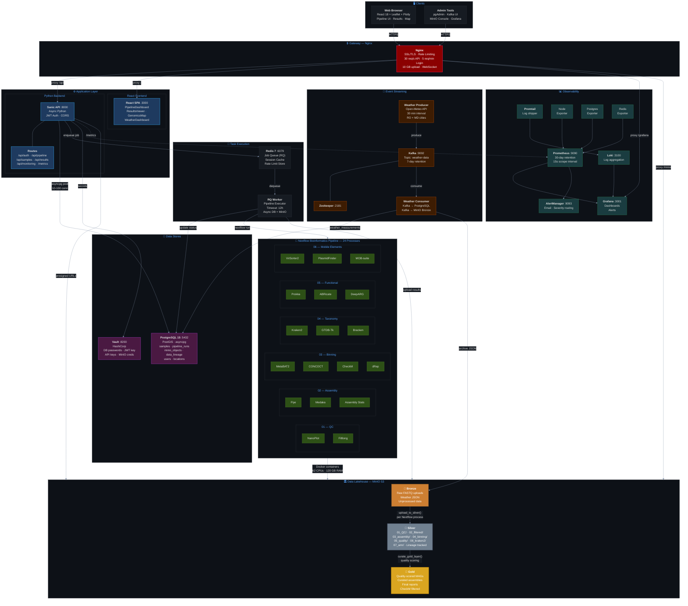

# UPGRADE Platform — Architecture Diagram

## Component Summary

| Layer | Components | Purpose |
|-------|-----------|---------|
| **Gateway** | Nginx (SSL, rate limiting) | Single entry point, security |
| **Frontend** | React 18 + Leaflet + Plotly | Pipeline UI, maps, results |
| **API** | Sanic (async Python) | REST API, JWT auth, routing |
| **Queue** | Redis 7 + RQ Worker | Async pipeline job execution |
| **Pipeline** | Nextflow DSL2 (24 processes) | Metagenomic analysis |
| **Lakehouse** | MinIO (Bronze → Silver → Gold) | Data lifecycle with lineage |
| **Database** | PostgreSQL 15 + PostGIS | Metadata, samples, lineage |
| **Streaming** | Kafka + Zookeeper | Weather data ingestion |
| **Secrets** | HashiCorp Vault | Credential management |
| **Observability** | Prometheus + Grafana + Loki | Metrics, dashboards, logs |

## Port Map

| Service | Port | Access |
|---------|------|--------|
| Nginx | 80, 443 | Public |
| React Frontend | 3000 | Via Nginx |
| Sanic Backend | 8000 | Via Nginx |
| PostgreSQL | 5432 | Internal |
| Redis | 6379 | Internal |
| MinIO API | 9000 | Internal |
| MinIO Console | 9001 | Admin |
| Kafka | 9092 | Internal |
| Kafka UI | 8080 | Admin |
| Prometheus | 9090 | Admin |
| Grafana | 3001 | Via Nginx |
| Vault | 8200 | Admin |
| pgAdmin | 5050 | Admin |
