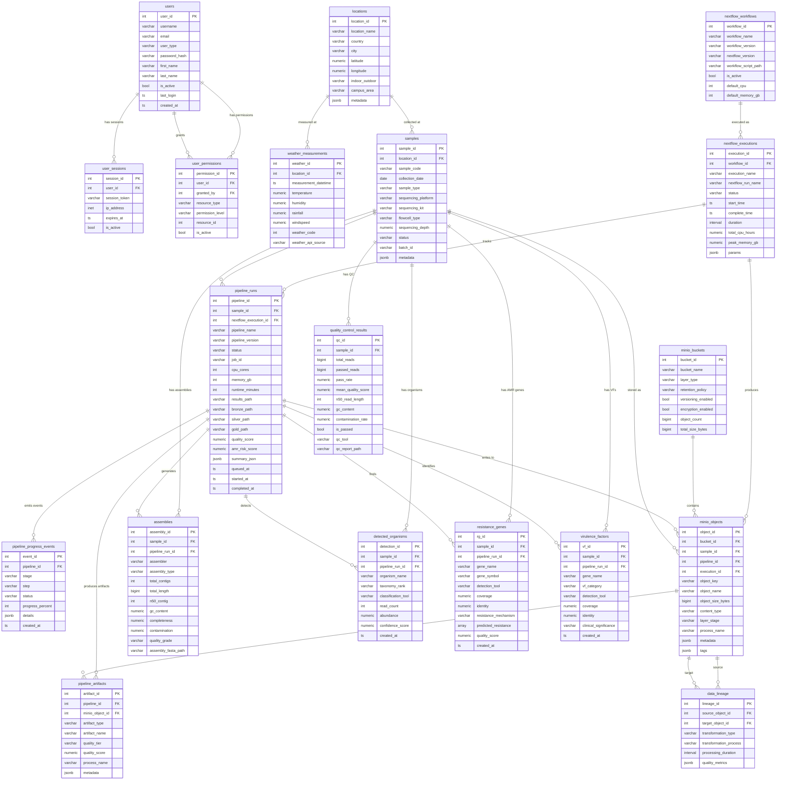

# UPGRADE Platform — Entity Relationship Diagram

> **19 active tables** after schema cleanup (was 53).
> Grouped by domain. Generated 2026-03-17.

---

## Domain map

| Domain | Tables | Purpose |
|--------|--------|---------|
| **Auth** | `users`, `user_sessions`, `user_permissions` | Login, RBAC, session management |
| **Geography** | `locations`, `weather_measurements` | Sampling sites + Open-Meteo weather data |
| **Samples** | `samples` | Core biological sample registry (787 samples) |
| **Nextflow** | `nextflow_workflows`, `nextflow_executions` | Pipeline orchestration metadata |
| **Pipeline core** | `pipeline_runs`, `pipeline_progress_events`, `pipeline_artifacts` | RQ job tracking, progress events, lakehouse artifacts |
| **Lakehouse** | `minio_buckets`, `minio_objects`, `data_lineage` | Bronze→Silver→Gold object store + transformation lineage |
| **Analysis** | `assemblies`, `quality_control_results`, `detected_organisms`, `resistance_genes`, `virulence_factors` | Bioinformatics pipeline outputs |

---

## Tables to watch

| Table | Rows | Issue |
|-------|------|-------|
| `data_lineage` | 12 958 | 3 MB — populated but no frontend API endpoint |
| `nextflow_executions` | 597 | Populated but not surfaced on frontend |
| `detected_organisms` | 0 | Kraken2/Bracken results not stored here yet |
| `virulence_factors` | 0 | DeepARG VF results not stored here yet |
| `quality_control_results` | 38 | Populated but not shown on frontend |
