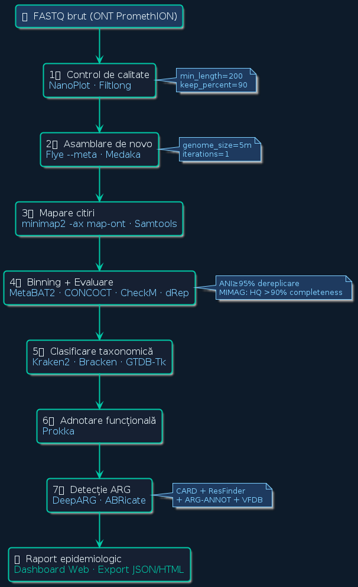
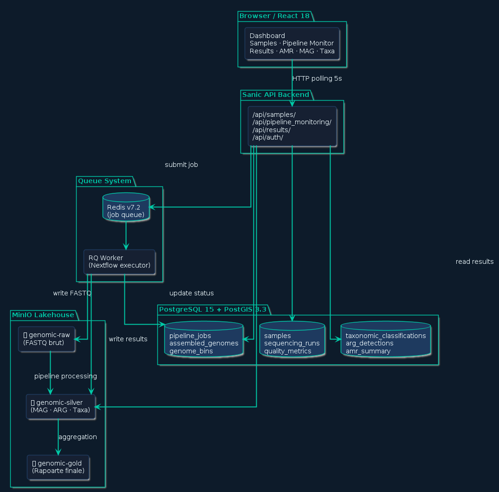

<!-- _paginate: false -->

  

# UPGRADE

## Unified Platform for Genomic Resistance Analysis, Detection and Environmental Surveillance

 

**Platformă bioinformatică end-to-end pentru supravegherea automată**
**a rezistenței la antimicrobiene din apele reziduale urbane**

  

---
Universitatea Tehnică a Moldovei &nbsp;·&nbsp; 2025

---

# Ce problemă rezolvă UPGRADE?

### Rezistența la antibiotice ucide oameni — acum

🦠 <strong>1.27 milioane</strong> de oameni mor în fiecare an din cauza bacteriilor rezistente la antibiotice — <em>mai mult decât HIV sau malaria</em>

📈 Dacă nu facem nimic, până în <strong>2050</strong> vor fi <strong>10 milioane de decese/an</strong>

🌍 Bacteriile rezistente nu respectă granițe — se răspândesc prin apă, sol, animale, oameni

### De ce apele reziduale?

> Canalizarea unui oraș concentrează bacteriile de la **toată populația** — e ca un test de sânge pentru întreg orașul. Dacă detectăm rezistența acolo, avem **6–12 luni avans** față de clinici.

### Problema concretă: nu există un instrument complet

🔬 Analiza metagenomică ONT necesită <strong>18+ instrumente</strong> bioinformatice separate, fiecare cu propriul format

💾 Un singur eșantion generează <strong>10–50 GB de date</strong> — infrastructură complexă, costuri mari

🧑‍🔬 Necesită expertiză bioinformatică avansată — <strong>inaccesibil</strong> pentru laboratoarele clinice și autoritățile de sănătate publică

🔁 Rezultatele <strong>nu sunt reproductibile</strong> fără containerizare — studii incomparabile între laboratoare

**UPGRADE rezolvă toate aceste probleme simultan:**
de la date brute FASTQ până la raport epidemiologic, **complet automat**.

---

# Scopul și obiectivele lucrării

Am creat o <strong>platformă completă</strong> care preia date brute de secvențiere de la orice laborator, le procesează automat prin 7 etape bioinformatice și produce rapoarte despre ce bacterii rezistente există în probă — <em>fără ca utilizatorul să știe bioinformatică</em>.

### Ce am construit

🏗️ <strong>Arhitectură Lakehouse</strong> — sistem de stocare scalabil pe 3 niveluri (Bronze/Silver/Gold) care organizează automat datele genomice de la brut la raport final

⚙️ <strong>Pipeline automat în 7 etape</strong> — de la FASTQ la gene de rezistență identificate, orchestrat prin Nextflow, containerizat cu Docker

🌐 <strong>Interfață web</strong> accesibilă cercetătorilor fără expertiză bioinformatică — submit probă, urmărire în timp real, vizualizare rezultate

### De ce contează

🔬 <strong>Long-read ONT</strong> — primul sistem open-source care combină citiri lungi nanopore cu arhitectură Lakehouse pentru AMR

🔁 <strong>Reproductibilitate garantată</strong> — SHA256 la fiecare etapă, Docker cu versiuni fixate, Nextflow caching

🌍 <strong>Impact real</strong> — testat pe <strong>53 eșantioane reale</strong> NCBI SRA din ape reziduale urbane, seawater și mediu

---

# Secvențierea ONT Long-Read — de ce contează pentru AMR

### Problema cu citirile scurte (Illumina, 150 bp)

- Fragmentează genele de rezistență și elementele mobile
- **Nu poate reconstrui plasmidele** — principalul vector de răspândire a ARG
- Operonii ribozomali (4–7 kb) sunt fragmentați → ambiguitate taxonomică
- Transpozoni și integroni (2–50 kb) sunt imposibil de asamblat complet

 

### ONT Long-Read rezolvă asta

| Caracteristică | Illumina | ONT R10.4.1 |
|---|---|---|
| Lungime citire | 150 bp | **N50 > 10 kb** |
| Acuratețe | Q30+ | **Q20+ (SUP)** |
| Plasmide | ✗ | **✓ complete** |
| Integroni/Tn | ✗ | **✓ integral** |
| Timp real | ✗ | **✓ streaming** |

### Long-read schimbă ce putem detecta

🧬 <strong>Cromozomi bacterieni completi</strong> dintr-un singur scaffold — știm exact ce organism poartă rezistența

💊 <strong>Plasmide 1–200+ kb reconstituite complet</strong> — putem evalua dacă o genă ARG se poate transfera la alte bacterii prin conjugare

🔗 <strong>Contextul genetic complet al ARG</strong> — știm dacă o genă de rezistență este pe un integron de clasă 1, transpozon sau cromozom → evaluăm riscul de răspândire

🔬 <strong>Metilaree directă</strong> — detectăm sisteme de restricție fără preparare chimică suplimentară

> UPGRADE procesează date **PromethION R10.4.1** din arhiva NCBI SRA — chimia cea mai recentă ONT cu acuratețe maximă.

---

# Pipeline Bioinformatic — 7 Etape

### Instrumente cheie

| Etapă | Instrumente |
|-------|------------|
| QC | NanoPlot · Filtlong |
| Asamblare | Flye `--meta` · Medaka |
| Mapare | minimap2 `-ax map-ont` |
| Binning | MetaBAT2 · CONCOCT · dRep |
| Evaluare | CheckM v1.2.2 (MIMAG) |
| Taxonomie | Kraken2 · Bracken · GTDB-Tk |
| Adnotare | Prokka |
| ARG | DeepARG · ABRicate |

### Orchestrare

- **Nextflow DSL2** — 13 module independente
- **18 imagini Docker** cu hash SHA256 fixat
- **Redis + RQ Worker** — execuție asincronă
- Caching — reia din etapa întreruptă

---

# Arhitectura Platformei UPGRADE

### Lakehouse Medallion

| Strat | Ce conține |
|-------|-----------|
| 🥉 **Bronze** | FASTQ brut + checksum SHA256 |
| 🥈 **Silver** | MAG · ARG · taxonomie procesate |
| 🥇 **Gold** | Rapoarte epidemiologice finale |

 

### PostgreSQL 15 — metadate complete

- **12 tabele** în schema publică
- `samples` — probe, coordonate GPS (PostGIS 3.3), checksumuri
- `pipeline_jobs` — stare execuție, resurse, erori
- `genome_bins` — completitudine/contaminare MAG
- `arg_detections` — gene ARG identificate, baza de date sursă
- `amr_summary` — raport agregat per probă
- Interogări geospațiale: *"toate probele în 50 km de București"*

---

# Aplicația Realizată

### Dashboard web — React 18 + Sanic API

📊 <strong>Monitorizare în timp real</strong> — polling HTTP la 5s, stadii: pending → running → completed

🗺️ <strong>Hartă geospațială</strong> Leaflet — distribuția geografică a ARG cu clustering automat

🦠 <strong>Profil taxonomic</strong> — stacked bar charts Recharts la nivel phylum/familie/specie

💊 <strong>AMR Risk Score</strong> 0–100 — clasificare automată High/Medium/Low cu 25+ genuri patogene cunoscute

🧬 <strong>MAG Quality Dashboard</strong> — completitudine, contaminare, filtrare MIMAG automată

### Rezultate pe date reale

  53
  eșantioane procesate

  382
  gene ARG / eșantion urban

  >95%
  completitudine MAG HQ

### Export & integrare

- Rapoarte **JSON + HTML** pentru sisteme externe
- API REST documentat pentru integrare cu sisteme naționale AMR
- Toate rezultatele stocate în MinIO Silver cu path structurat: `{sample}/{pipeline_id}/`

---

# Concluzii

UPGRADE demonstrează că <strong>supravegherea metagenomică AMR la scară națională</strong> poate fi <em>automatizată, reproductibilă și accesibilă</em> — nu doar pentru laboratoare de elită, ci pentru orice instituție cu un server și date de secvențiere.

### Ce aduce nou

🌍 <strong>Prima platformă open-source</strong> care combină ONT long-read + Lakehouse + detectare ARG + interfață web într-un singur sistem integrat

⚡ <strong>De la FASTQ la raport epidemiologic</strong> complet automat — fără intervenție manuală, fără expertiză bioinformatică necesară

🔬 <strong>Long-read ONT permite</strong> reconstrucția completă a plasmidelor și elementelor genetice mobile — esențial pentru evaluarea riscului de răspândire a rezistenței

### Impact potențial

- **Supraveghere continuă** a rezistenței la antibiotice în apele reziduale urbane — semnal de alertă precoce pentru sistemul de sănătate publică
- **Comparabilitate** între studii și laboratoare prin reproducibilitate garantată
- **Scalabil** de la un singur server de laborator la infrastructuri naționale

### Limitări și direcții

- RAM 120 GB necesar pentru asamblare la scară mare
- Validare experimentală sistematică în desfășurare
- **Roadmap:** suport Illumina (hybrid assembly), integrare cu rețele naționale de supraveghere AMR, extindere la ≥500 eșantioane

---

<!-- _paginate: false -->

   

# Mulțumesc pentru atenție!

 

**UPGRADE** — platformă bioinformatică end-to-end
pentru supravegherea metagenomică a AMR

 

MinIO Lakehouse
PostgreSQL 15 + PostGIS
Sanic + Redis + RQ
Nextflow DSL2
React 18
ONT PromethION

**Universitatea Tehnică a Moldovei**
Facultatea de Calculatoare, Informatică și Microelectronică

 

*53 eșantioane reale procesate · 7 etape pipeline · 18 instrumente Docker*

